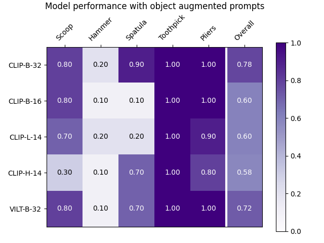
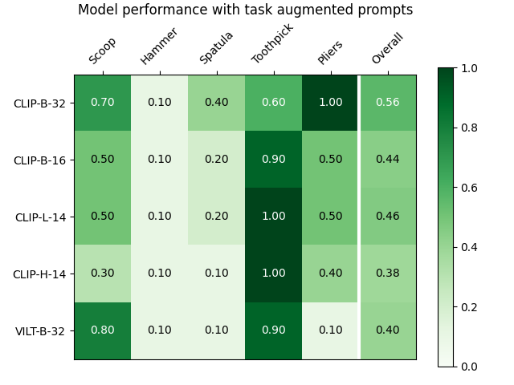
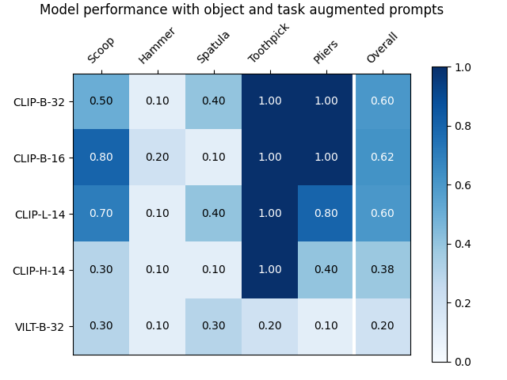

# Creative problem solving in LLMs
This repository contains data and code for preliminary experiments demonstrating creative problem solving in LLMs, inspired by Computational Creativity literature. The code provided in this repository prompts LLMs (image + text prompts) to identify creative object replacements (object substitution) when the required objects are missing, e.g., substituting a bowl for a scoop. <ins>This work shows that prompts that are augmented with relevant object features (i.e., affordances) enable LLMs to effectively reason about object substitutions</ins>.

## Instructions for running the code
This repository requires [Pytorch](https://github.com/pytorch/pytorch) and HuggingFace [Transformers](https://github.com/huggingface/transformers) libraries. 
```
pip install -r requirements.txt
```

Running with the default seed setting (`seed=42`) will reproduce results from the paper, shown in the images below. To run the code:
```
cd creative-problem-solving
python eval_task.py --task-type creative-obj
```
Details of the models and task prompts are available in `dataset_cfg.py`. The task types include `creative-obj` that adds object feature information (affordance) to the prompt; `creative-task` that adds task information to the prompt; and `creative-task-obj` that combines object and task information. Additionally `nominal` uses regular prompts, tested on cases where object replacement is not required, and `creative` tests the models with regular prompts in cases where an object replacement is required. The code runs the evaluation (creating random test sets based on the seed) and reports the result via plots as shown below.

### Using the `creative` prompt


### Using the `creative-obj` prompt


### Using the `creative-task` prompt


### Using the `creative-task-obj` prompt


The full testing dataset consists of 16 RGB images of objects, from which subsets are randomly chosen.


## Reproducibility and compute resources note
This code was tested with `Python 3.10.12`. It was run on a single NVIDIA A100 GPU. All the versions of other packages used are noted in `requirements.txt`. We installed Pytorch 1.13.0 for CUDA 11.6. For more details on installation, please see Pytorch [Installation Instructions](https://pytorch.org/get-started/locally/).
